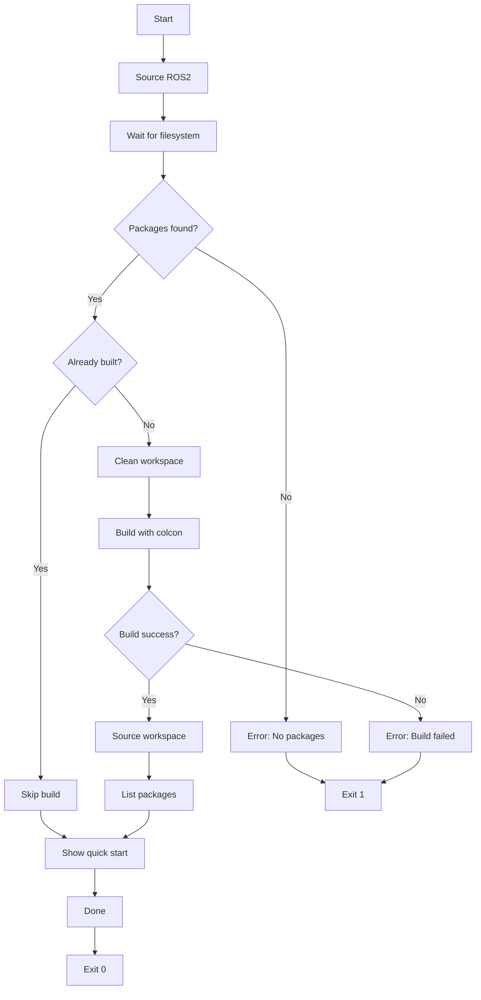

## Overview

The `post-start.sh` script runs every time the development container starts. It verifies the workspace, builds it if necessary, and provides quick start instructions.

**Location**: `.devcontainer/post-start.sh`

**Execution**: Automatically run by `postStartCommand` in devcontainer.json

**Runtime**: 
- First run: 2-3 minutes (full build)
- Subsequent runs: < 5 seconds (skip build)

## Script structure

### Initialization

```bash
#!/bin/bash
set -e

echo "=========================================="
echo "Post-start: Building TurtleBot3 workspace"
echo "=========================================="
```

Sets strict error handling and displays banner.

### Environment setup

```bash
source /opt/ros/jazzy/setup.bash
cd /workspace/turtlebot3_ws
```

Sources ROS2 Jazzy and navigates to workspace.

### Filesystem synchronization

```bash
sleep 2
```

**Purpose**: Waits for filesystem to fully synchronize

**Why needed**: Some mount types (especially on Windows) may have delayed file availability

### Package verification

```bash
PACKAGE_COUNT=$(find src/ -name "package.xml" 2>/dev/null | wc -l)

if [ "$PACKAGE_COUNT" -eq 0 ]; then
    # Try ls method for Windows mounts
    PACKAGE_COUNT=$(ls src/*/package.xml 2>/dev/null | wc -l)
fi

echo "Found $PACKAGE_COUNT ROS2 packages"

if [ "$PACKAGE_COUNT" -eq 0 ]; then
    echo "[ERROR] No packages found!"
    echo "Something went wrong with post-create.sh"
    echo "The container may not work correctly."
    exit 1
fi
```

**Verification steps**:
1. Try to find packages using `find` command
2. If no packages found, try `ls` method (Windows compatibility)
3. Report count
4. Exit with error if no packages found

**Why two methods**: Windows mounts sometimes don't work well with `find`, so `ls` provides a fallback.

### Build status check

```bash
if [ -f "install/setup.bash" ]; then
    source install/setup.bash
    
    if ros2 pkg list | grep -q turtlebot3; then
        echo "[OK] Workspace already built"
        
        echo ""
        echo "=========================================="
        echo "[OK] TurtleBot3 Jazzy ready!"
        echo "=========================================="
        echo ""
        echo "Quick start:"
        echo "  tb3_empty  - Launch empty world"
        echo "  tb3_teleop - Keyboard control"
        echo "  VNC: http://localhost:6080 (password: ros)"
        echo "=========================================="
        exit 0
    fi
fi
```

**Logic**:
1. Check if `install/setup.bash` exists
2. Source it if it does
3. Verify TurtleBot3 packages are available
4. If yes: Skip build and exit successfully
5. If no: Continue to build phase

**Performance optimization**: Avoids unnecessary rebuilds on container restart.

### Workspace build

```bash
echo "Building workspace... (first time: 2-3 minutes)"
echo ""

rm -rf build install log

colcon build --symlink-install --cmake-args -DCMAKE_BUILD_TYPE=Release

if [ $? -ne 0 ]; then
    echo ""
    echo "[ERROR] Build failed!"
    exit 1
fi
```

**Build process**:
1. Display estimated build time
2. Clean previous build artifacts
3. Run colcon build with optimized settings
4. Check exit status
5. Exit with error if build fails

**Build flags**:
- `--symlink-install`: Create symlinks instead of copying files (faster iteration)
- `--cmake-args -DCMAKE_BUILD_TYPE=Release`: Optimized release build

### Build verification

```bash
echo ""
echo "[OK] Build successful!"
source install/setup.bash

echo ""
echo "TurtleBot3 packages:"
ros2 pkg list | grep turtlebot3
```

**Verification**:
1. Source the newly built workspace
2. List all TurtleBot3 packages
3. Provides visual confirmation of what was built

**Expected packages**:
- turtlebot3
- turtlebot3_bringup
- turtlebot3_cartographer
- turtlebot3_description
- turtlebot3_fake_node
- turtlebot3_gazebo
- turtlebot3_navigation2
- turtlebot3_node
- turtlebot3_teleop
- turtlebot3_example (if available)

### Success message

```bash
echo ""
echo "=========================================="
echo "[OK] TurtleBot3 Jazzy ready!"
echo "=========================================="
echo ""
echo "Quick start:"
echo "  tb3_empty  - Launch empty world"
echo "  tb3_teleop - Keyboard control"
echo "  VNC: http://localhost:6080 (password: ros)"
echo "=========================================="
```

Provides immediate guidance on how to start using the environment.

## Execution flow



## Exit codes

| Code | Meaning |
|------|----------|
| 0 | Success (workspace ready) |
| 1 | Error (no packages or build failed) |

## Build optimization

### Symlink install

```bash
--symlink-install
```

**Benefits**:
- Faster development iteration
- No need to rebuild when editing Python scripts or launch files
- Reduces disk space usage

**How it works**: Instead of copying files to `install/`, creates symlinks to `src/`

### Release build

```bash
--cmake-args -DCMAKE_BUILD_TYPE=Release
```

**Benefits**:
- Optimized code generation
- Better runtime performance
- Smaller binary sizes

**Trade-off**: Harder to debug (no debug symbols)

## Common scenarios

### First container start

```bash
# Full build process
[Post-start] Found 15 packages
[Post-start] Building workspace... (2-3 minutes)
[colcon output...]
[Post-start] Build successful!
[Post-start] TurtleBot3 packages:
  turtlebot3
  turtlebot3_gazebo
  ...
[Post-start] TurtleBot3 Jazzy ready!
```

### Container restart

```bash
# Skip build
[Post-start] Found 15 packages
[Post-start] Workspace already built
[Post-start] TurtleBot3 Jazzy ready!
```

### After modifying source code

Container restart will skip the build. To rebuild:

```bash
# Use the cb alias
cb
```

Or manually:

```bash
cd /workspace/turtlebot3_ws
colcon build --symlink-install
```

## Troubleshooting

### No packages found error

```
[ERROR] No packages found!
Something went wrong with post-create.sh
```

**Cause**: post-create.sh didn't run successfully or repositories weren't cloned

**Solution**:
```bash
bash /workspace/turtlebot3_ws/.devcontainer/post-create.sh
```

### Build failed error

```
[ERROR] Build failed!
```

**Cause**: Missing dependencies or compilation errors

**Solution**:
```bash
# Update dependencies
rosdep update
rosdep install --from-paths src --ignore-src -r -y

# Try building again
cb
```

### Build succeeds but packages not found

**Cause**: Workspace not sourced

**Solution**:
```bash
sb  # source /workspace/turtlebot3_ws/install/setup.bash
```

### Long build times on subsequent runs

**Cause**: Clean build is triggered instead of incremental

**Solution**: The script only does a clean build on first run. For manual builds, avoid `rm -rf build install log` and just run:
```bash
colcon build --symlink-install
```

## Performance considerations

### Build time factors

| Factor | Impact |
|--------|--------|
| Number of CPU cores | Higher = faster |
| Disk I/O speed | SSD much faster than HDD |
| Available RAM | Low RAM = slower builds |
| Network mount | Local disk faster than network |

### Parallel builds

Colcon automatically uses parallel builds. To limit:

```bash
colcon build --parallel-workers 2
```

## Integration with development workflow

1. **Container start**: post-start.sh ensures workspace is ready
2. **Development**: Edit code in `src/`
3. **Build**: Use `cb` alias
4. **Source**: Use `sb` alias
5. **Test**: Run your nodes/launch files
6. **Iterate**: Repeat steps 2-5
